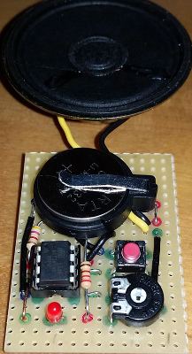

<h1>Arduino Music Box</h1>
<table>
<tr><th>Date</th><td>2015-12</td></tr>
<tr><th>Tool Version</th><td>Arduino IDE 1.6.5 (Windows) (arduino.avrdude=6.0.1-arduino5, arduino.avr-gcc=4.8.1-arduino5)</td></tr>
<tr><th>Keywords</th><td>Arduino Uno, ATmega328, ATtiny45, AVR assembler</td></tr>
</table>

<h2>Introduction</h2>

After playing some time with the Arduino Uno I wanted to learn more about the features of the ATmega328P
  without the "Arduino OS" shell. To get as close as possible to the chip I decided to use
  assembler. I use the tools from the Windows Arduino IDE (as, ld, objcopy, avrdude). The Atmel
  VR Toolchain should work as well. For Linux it should be sufficient to modify the 'Makefile'.

A result is this Music Box which plays songs in horrible quality.

Features used:

<ul>
<li>two timers for pitch (toggles the OC0A pin) and duration (interrupt, wake up idle sleep)</li>
<li>sleep in idle and power down mode (no active wait)</li>
<li>external interrupt (e.g. wake up from power down)</li>
</ul>

As the Music Box only uses two timers and an external interrupt the ATmega328 is a bit too mega. Next I
  shrinked the hardware to an ATtiny45.

<h2>License</h2>

<a href="LICENSE.md">MIT License</a>

<h2>Files</h2>

<table>
  <tr><td>Ly2Asm.rb</td><td>Ruby Script to convert lilypond like music to assembler tables (songs.asm)</td></tr>
  <tr><td>Makefile</td><td>Compile, link and flash</td></tr>
  <tr><td>Notes.rb</td><td>Ruby Script to create pitch and duration assember tables (notes.*.asm)</td></tr>
  <tr><td>atmega328p.asm</td><td>Functions for ATmega368P</td></tr>
  <tr><td>atmega368p.inc</td><td>Definitions for ATmega368P</td></tr>
  <tr><td>attiny45.asm</td><td>Functions for ATtiny45</td></tr>
  <tr><td>attiny45.inc</td><td>Definitions for ATtiny45</td></tr>
  <tr><td>main.asm</td><td>Common code for playing the songs (interpreting the generated tables)</td></tr>
  <tr><td>notes.atmega328p.asm</td><td>Generated by Notes.rb for ATmega368</td></tr>
  <tr><td>notes.attiny45.asm</td><td>Generated by Notes.rb for ATtiny45</td></tr>
  <tr><td>songs.asm</td><td>Generated by Ly2Asm.rb</td></tr>
</table>

<h2>Hardware Configuration</h2>

<table>
  <tr><th></th><th>ATmega328P (Arduino Uno rev3)</th><th>ATtiny45</th></tr>
  <tr><th>Clock</th><td>extern 16MHz</td><td>intern 1MHz</td></tr>
  <tr><th>Power</th><td>5V</td><td>3V - 5V</td></tr>
  <tr><th>Speaker</th><td>Pin 12 (Port D6 / <b>OC0A</b>, Arduino Pin 6)</td><td>Pin 5 (Port B0 / <b>OC0A</b>)</td></tr>
  <tr><th>NextButton</th><td>Pin  4 (Port D2 / <b>INT0</b>, Arduino Pin 2)</td><td>Pin 7 (Port B2 / <b>INT0</b>)</td></tr>
  <tr><th>LED (opt)</th><td>Pin 18 (<b>Port B4</b>, Arduino Pin 12)</td><td>Pin 3 (<b>Port B4</b>)</td></tr>
</table>

<h2>Compiling the Software</h2>
If you don't want to compile yourself, upload the included .hex file with avrdude.
<ul>
  <li>If you don't have a 'make' get and install it (http://gnuwin32.sourceforge.net/packages/make.htm)</li>
  <li>You need Ruby if you want to recreate the generated .asm files (https://www.ruby-lang.org/)</li>
  <li>Open command line box, change directory to where this files are located</li>
  <li>Check the settings at the top of the 'Makefile'</li>
  <li>Run 'make' to create the hex file</li>
</ul>

<h2>Setup and Upload</h2>

<h3>ATmega328</h3>
<ul>
  <li>Setup Arduino Uno, speaker, resistor 1k, LED (opt), resistor 220 (opt) as shown in the <a href="music-box.png">picture</a></li>
  <li>Run 'make Upload328' to upload the hex file</li>
</ul>

<h3>ATtiny45</h3>
<ul>
  <li>To upload the Music Box to the ATtiny45 with an Arduino Uno board as programmer follow the instructions on http://highlowtech.org/?p=1695 'connecting an Arduino (as ISP) to an ATtiny'</li>
  <li>Run 'make Upload45' to upload the hex file</li>
  <li>Setup ATtiny45, speaker, resistor 1k, LED (opt), resistor 220 (opt) as shown in the <a href="music-box.png">picture</a></li>
</ul>
  
There should be some blinking and music now.

<h2>Music Box Usage</h2>

After a hard reset the Music Box plays 3 songs and then goes to power down mode. A button press
wakes it up again and it will play another 3 songs.

Pressing the button short while music is playing will forward to the next song.
  Pressing it long will put the Music Box in power down mode.

<h2>Getting more Music</h2>

The Ly2Asm.rb script uses a simplified lilypond syntax for reading music and
converting it to assember tables.

The music is defined in hashes with the the keys:

<table>
  <tr><td>:title</td><td>label in the assembler file</td></tr>
  <tr><td>:speed</td><td>tick-counter - the higher the slower (0-255)</td></tr>
  <tr><td>:sections</td><td>list of one or more strings in simplified lilypond format</td></tr>
  <tr><td>:order</td><td>order in which the sections are to be played (counting from 1), this is a way to implement repetitions</td></tr>
</table>

Restriction of the script:

<ul>
  <li>only one voice</li>
  <li>pitches are in lilypond standard notation (aes, a, ais, bes, b, bis, ces, c, ...) - german 'h' has to be replaced by 'b', while 'b' is 'bes'</li>
  <li>duratation are 1, 2, 4, 8, 16 and "dot"ed (e.g. '4.')</li>
  <li>slurs are '(', ')', '~', they have to be after the note</li>
  <li>pitch notation is relative, use ''', ',' for up/down to the next octave</li>
  <li>'[', ']', '|' are allowed but ignored</li>
  <li>nothing else is allowed, e.g. 'd4-^, 'e2-.' or keywords '\break', ':|'</li>
</ul>

<h2>Links</h2>
<ul>
  <li>http://www.atmel.com/images/Atmel-8271-8-bit-AVR-Microcontroller-ATmega48A-48PA-88A-88PA-168A-168PA-328-328P_datasheet_Complete.pdf</li>
  <li>http://www.atmel.com/Images/Atmel-2586-AVR-8-bit-Microcontroller-ATtiny25-ATtiny45-ATtiny85_Datasheet.pdf</li>
  <li>http://www.atmel.com/Images/Atmel-0856-AVR-Instruction-Set-Manual.pdf</li>
</ul>
<ul>
  <li>http://www.lilypond.org/</li>
  <li>https://github.com/Musikpiraten/public-domain-season-songs/</li>
  <li>https://gcc.gnu.org/wiki/avr-gcc/ (not used)</li>
</ul>
